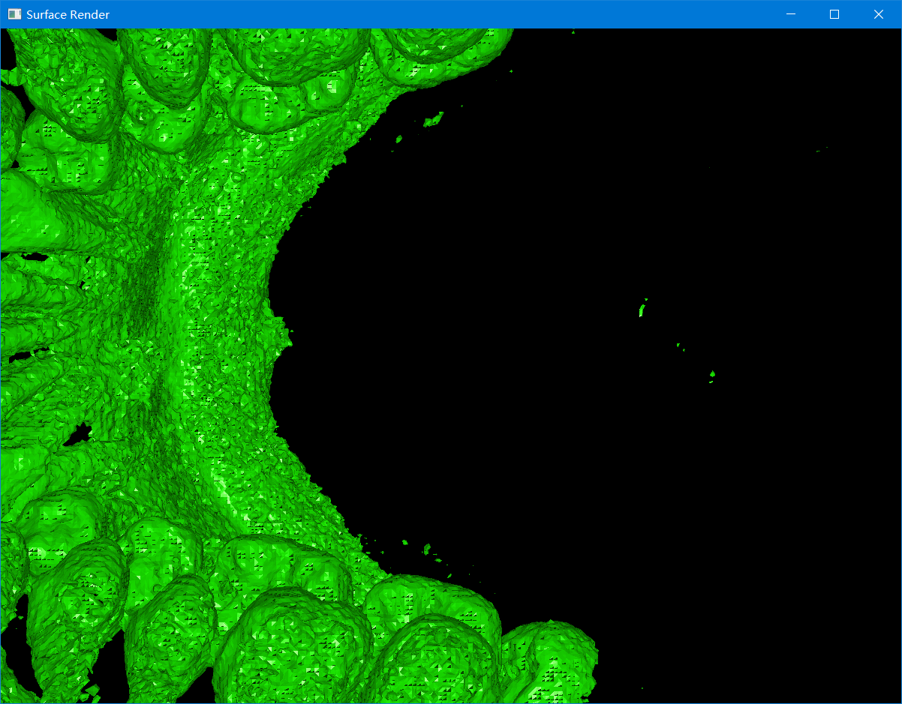
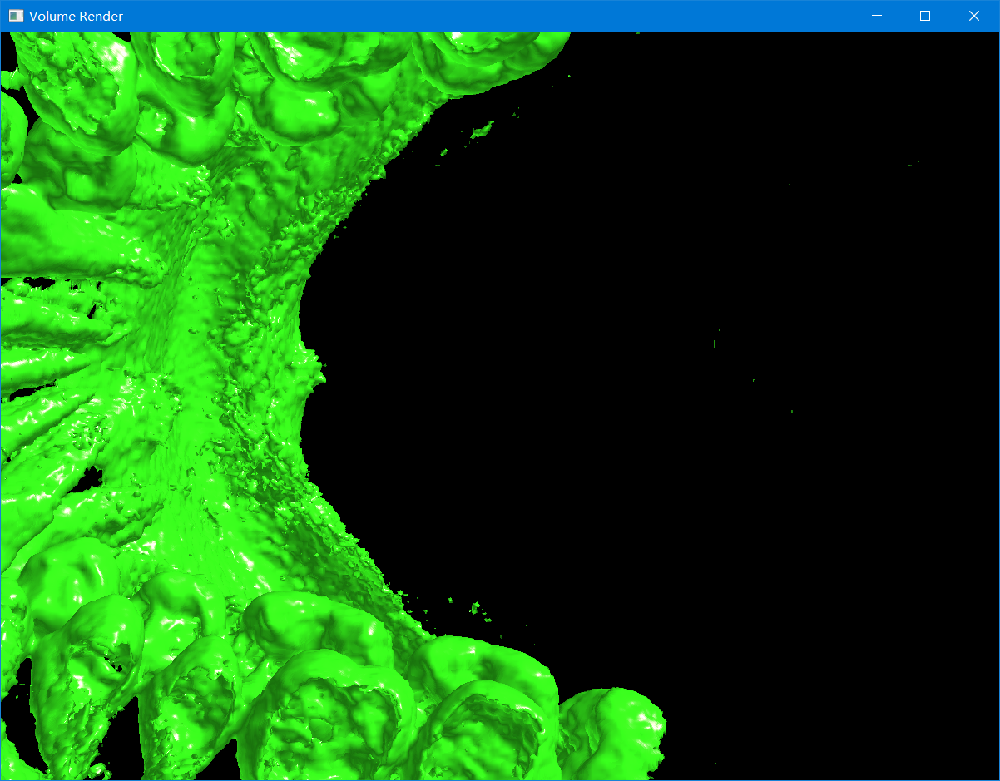

# MarchingCube && VolumeRender

## Requirements
* C++11 compiler
* cmake >= 3.16
* OpenMP support (optional)

##third_party
* glad
* glfw
* glm 
* cmdline (parse cmd args)
* nlohmann::json (load transfer function config file)
# Marching Cube



 *  window: 1200*900
 *  raw_volume dim: x=512 y=512 z=507
 *  iso_value: 2500
 *  cpu cost time(OpenMP): 3725ms (not include loading data from disk)
 *  triangles num: 294,6876
## help for usage
    MarchingCube.exe -h

# Volume Render


 *  window: 1200*900
 *  ray step=0.5 for x=512 y=512 z=507 (equal to 1.0/512*0.5 for texture sample)
 ```json
{
  "tf": {
    "0": [0.0,0.1,0.6,0.0],
    "120": [0.0,0.0,0.0,0.0],
    "121": [0.2,0.9,0.1,0.8],
    "255": [0.2,0.9,0.1,0.8]
  }
}
```
## help for usage
    VolumeRender.exe -h